# DSO101 Assignment 1 - Continuous Integration and Continuous Deployment

## Student Details

**Name:** Ashis Rai  
**Student ID:** 02240334  
**Course:** DSO101 - Continuous Integration and Continuous Deployment  
**Assignment:** Assignment 1  
**GitHub Repository:** AshisRai_02240334_DSO101_A1  
**Docker Hub Username:** ash5zero3  

---

## Project Overview

This project is a simple full-stack To-Do List web application created for DSO101 Assignment 1. The purpose of the assignment is to practise building a full-stack application, containerizing it using Docker, pushing Docker images to Docker Hub, deploying the application on Render, and setting up automated deployment using Render Blueprint.

The application allows users to:

- Add tasks
- View saved tasks
- Edit tasks
- Delete tasks
- Mark tasks as completed

The project contains three main parts:

1. **Step 0:** Build a simple full-stack To-Do application locally.
2. **Part A:** Build Docker images, push them to Docker Hub, and manually deploy them on Render.
3. **Part B:** Set up automated deployment using Render Blueprint and GitHub.

---

## Technology Stack

### Frontend

- React
- Vite
- Axios
- CSS

### Backend

- Node.js
- Express.js
- PostgreSQL
- dotenv
- cors
- pg

### DevOps / Deployment

- Docker
- Docker Hub
- Render
- Render Blueprint
- GitHub

---

## Folder Structure

```text
AshisRai_02240334_DSO101_A1/
│
├── screenshots/
│
├── todo-app/
│   ├── backend/
│   │   ├── Dockerfile
│   │   ├── .dockerignore
│   │   ├── package.json
│   │   ├── package-lock.json
│   │   ├── server.js
│   │   └── .env
│   │
│   └── frontend/
│       ├── Dockerfile
│       ├── .dockerignore
│       ├── package.json
│       ├── package-lock.json
│       ├── index.html
│       ├── src/
│       │   ├── App.jsx
│       │   ├── App.css
│       │   └── index.css
│       └── .env
│
├── render.yaml
├── .gitignore
└── README.md
```

> Note: The `.env` files were used locally but were not committed to GitHub.

---

# Step 0 - Creating the Full-Stack To-Do Application

## 1. Backend Setup

The backend folder was created inside the `todo-app` directory.

```bash
mkdir backend
cd backend
npm init -y
```

The required backend dependencies were installed:

```bash
npm install express cors dotenv pg
npm install --save-dev nodemon
```

The backend uses Express.js to create the API routes and PostgreSQL to store the tasks.

---

## 2. Backend Environment Variables

A `.env` file was created inside the backend folder.

```env
PORT=5000
DB_HOST=localhost
DB_USER=postgres
DB_PASSWORD=your_postgres_password
DB_NAME=todo_db
DB_PORT=5432
```

The `.env` file stores environment-specific values such as database credentials and server port.

The `.env` file was added to `.gitignore` to avoid exposing sensitive information.

---

## 3. PostgreSQL Database Setup

A PostgreSQL database named `todo_db` was created using pgAdmin.

The backend automatically creates a `tasks` table if it does not already exist.

The table contains:

```text
id
title
completed
```

### Screenshot: PostgreSQL tasks table

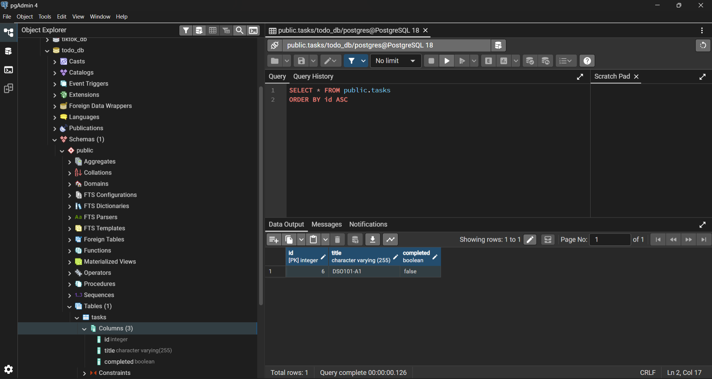

---

## 4. Backend CRUD API

The backend provides the following CRUD API endpoints:

| Method | Endpoint | Description |
|---|---|---|
| GET | `/` | Test if backend is running |
| GET | `/tasks` | Fetch all tasks |
| POST | `/tasks` | Add a new task |
| PUT | `/tasks/:id` | Update a task |
| DELETE | `/tasks/:id` | Delete a task |

The backend was tested locally using the browser and PowerShell.

### Screenshot: Backend running locally

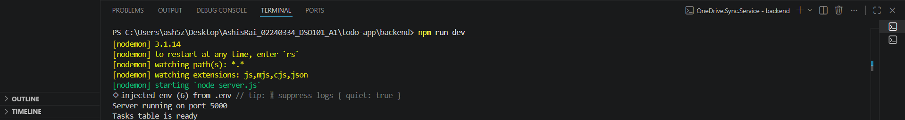

### Screenshot: Local `/tasks` endpoint

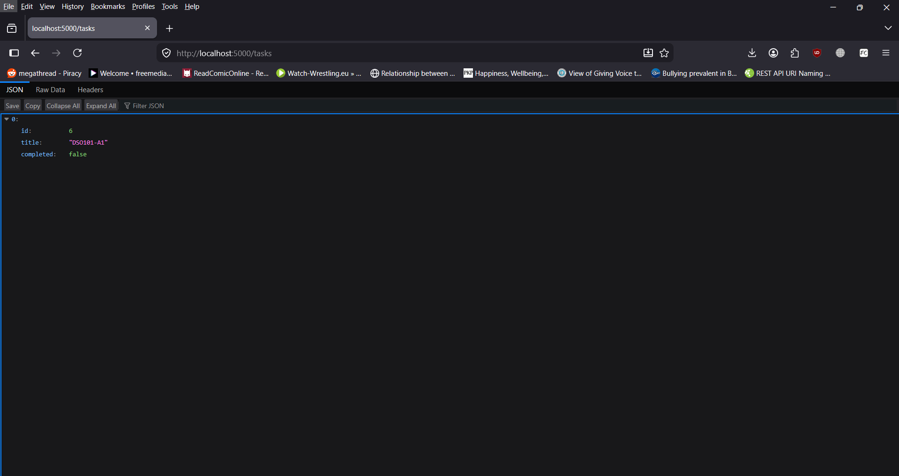

---

## 5. Frontend Setup

The frontend was created using Vite with React.

```bash
cd ../frontend
npm create vite@latest . -- --template react
npm install
npm install axios
```

A frontend `.env` file was created:

```env
VITE_API_URL=http://localhost:5000
```

The frontend uses Axios to connect to the backend API.

---

## 6. Frontend Features

The frontend allows users to:

- Add a task
- View all tasks
- Edit a task
- Delete a task
- Mark a task as completed

### Screenshot: Local frontend running


---

# Part A - Manual Docker Image Build and Render Deployment

## 1. Backend Dockerfile

A `Dockerfile` was created inside the backend folder.

```dockerfile
FROM node:18-alpine

WORKDIR /app

COPY package*.json ./

RUN npm install

COPY . .

EXPOSE 5000

CMD ["node", "server.js"]
```

A `.dockerignore` file was also created:

```text
node_modules
.env
```

---

## 2. Build Backend Docker Image

The backend Docker image was built using the student ID as the tag.

```bash
docker build -t ash5zero3/be-todo:02240334 .
```

The image was tested locally using:

```bash
docker run --name be-todo-test -p 5001:5000 -e PORT=5000 -e DB_HOST=host.docker.internal -e DB_USER=postgres -e DB_PASSWORD=your_postgres_password -e DB_NAME=todo_db -e DB_PORT=5432 ash5zero3/be-todo:02240334
```

### Screenshot: Backend Docker image running locally

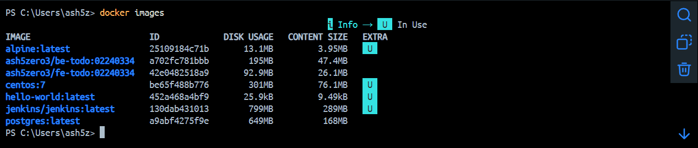

---

## 3. Push Backend Image to Docker Hub

The backend image was pushed to Docker Hub.

```bash
docker push ash5zero3/be-todo:02240334
```

Docker Hub backend image:

```text
ash5zero3/be-todo:02240334
```

### Screenshot: Backend image on Docker Hub

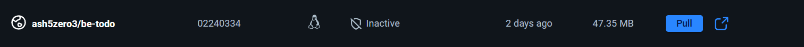

---

## 4. Frontend Dockerfile

A `Dockerfile` was created inside the frontend folder.

```dockerfile
FROM node:22-alpine AS build

WORKDIR /app

COPY package*.json ./

RUN npm install

COPY . .

ARG VITE_API_URL
ENV VITE_API_URL=$VITE_API_URL

RUN npm run build

FROM nginx:alpine

COPY --from=build /app/dist /usr/share/nginx/html

EXPOSE 80

CMD ["nginx", "-g", "daemon off;"]
```

A `.dockerignore` file was created:

```text
node_modules
.env
dist
```

---

## 5. Build Frontend Docker Image

The frontend Docker image was built using the student ID as the tag.

```bash
docker build -t ash5zero3/fe-todo:02240334 --build-arg VITE_API_URL=http://localhost:5000 .
```

The frontend Docker container was tested locally:

```bash
docker run --name fe-todo-test -p 3000:80 ash5zero3/fe-todo:02240334
```

### Screenshot: Frontend Docker running locally


---

## 6. Push Frontend Image to Docker Hub

The frontend image was pushed to Docker Hub.

```bash
docker push ash5zero3/fe-todo:02240334
```

Docker Hub frontend image:

```text
ash5zero3/fe-todo:02240334
```

### Screenshot: Frontend image on Docker Hub

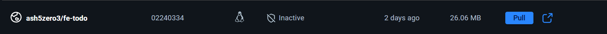

---

## 7. Render PostgreSQL Database

A PostgreSQL database was created on Render.

Database service name:

```text
todo-db
```

The database was used to store task data for the deployed application.

### Screenshot: Render PostgreSQL database

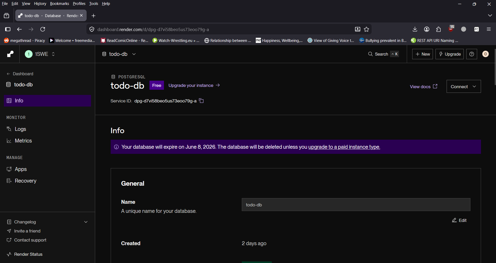

---

## 8. Manual Backend Deployment on Render

The backend was deployed on Render using the existing Docker Hub image:

```text
docker.io/ash5zero3/be-todo:02240334
```

Environment variables were added on Render:

```env
PORT=5000
DB_HOST=Render database host
DB_USER=Render database user
DB_PASSWORD=Render database password
DB_NAME=Render database name
DB_PORT=5432
```

The backend was tested using:

```text
https://your-part-a-backend-url.onrender.com
```

and:

```text
https://your-part-a-backend-url.onrender.com/tasks
```

### Screenshot: Manual backend Render deployment

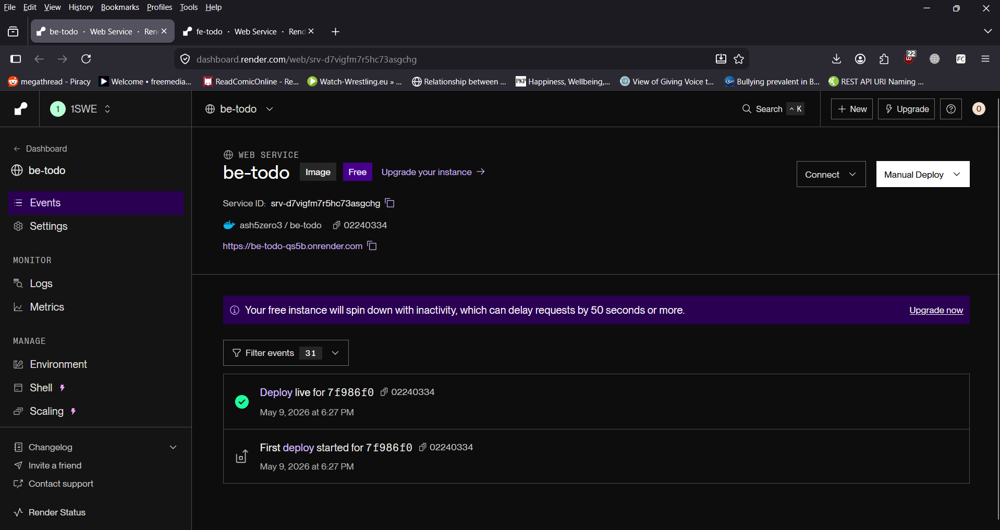

---

## 9. Manual Frontend Deployment on Render

The frontend image was rebuilt using the live backend URL.

```bash
docker build -t ash5zero3/fe-todo:02240334 --build-arg VITE_API_URL=https://your-part-a-backend-url.onrender.com .
docker push ash5zero3/fe-todo:02240334
```

The frontend was deployed on Render using:

```text
docker.io/ash5zero3/fe-todo:02240334
```

### Screenshot: Manual frontend Render deployment

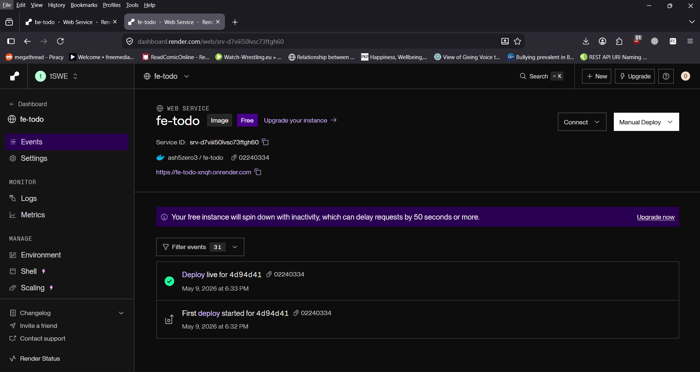


---

# Part B - Automated Deployment Using Render Blueprint

## 1. Purpose of Render Blueprint

Render Blueprint was used to automate deployment directly from the GitHub repository.

Whenever a new commit is pushed to GitHub, Render automatically rebuilds and redeploys the services.

---

## 2. Updating Backend for DATABASE_URL

The backend was updated to support `DATABASE_URL` for Render deployment.

```js
const pool = process.env.DATABASE_URL
  ? new Pool({
      connectionString: process.env.DATABASE_URL,
    })
  : new Pool({
      host: process.env.DB_HOST,
      user: process.env.DB_USER,
      password: process.env.DB_PASSWORD,
      database: process.env.DB_NAME,
      port: process.env.DB_PORT || 5432,
    });
```

This allows the backend to use local database variables during local development and `DATABASE_URL` during Render deployment.

---

## 3. Render Blueprint Configuration

A `render.yaml` file was created in the root of the repository.

```yaml
services:
  - type: web
    name: be-todo-02240334
    runtime: docker
    plan: free
    region: singapore
    dockerfilePath: ./todo-app/backend/Dockerfile
    dockerContext: ./todo-app/backend
    envVars:
      - key: PORT
        value: 5000
      - key: DATABASE_URL
        sync: false

  - type: web
    name: fe-todo-02240334
    runtime: docker
    plan: free
    region: singapore
    dockerfilePath: ./todo-app/frontend/Dockerfile
    dockerContext: ./todo-app/frontend
    envVars:
      - key: VITE_API_URL
        value: https://be-todo-02240334.onrender.com
```

The database was reused from the existing Render PostgreSQL database.

The `DATABASE_URL` was added securely through Render environment variables and was not committed to GitHub.

---

## 4. Blueprint Deployment

A Render Blueprint was created and connected to the GitHub repository.

Blueprint services created:

```text
be-todo-02240334
fe-todo-02240334
```

Both services were deployed in the Singapore region so that they could connect properly with the existing Render PostgreSQL database.

### Screenshot: Blueprint services on Render

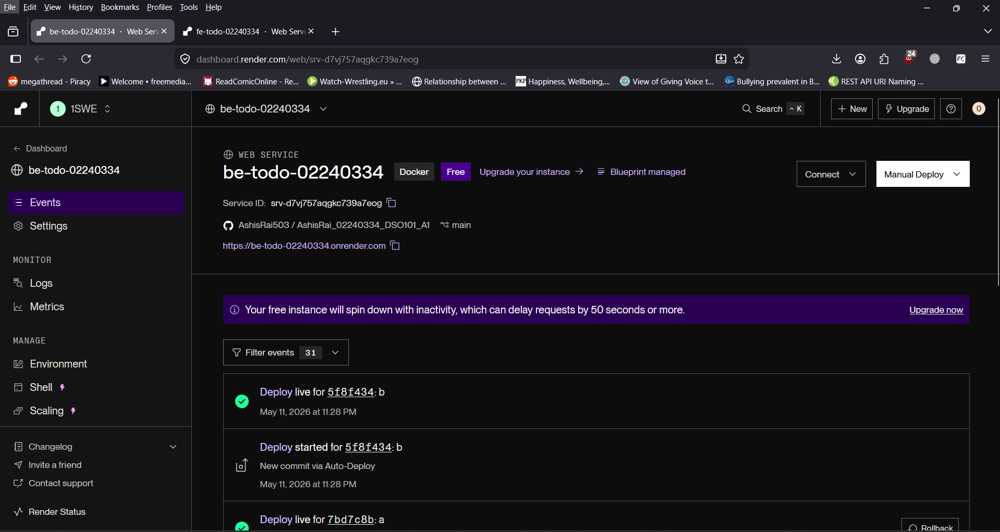
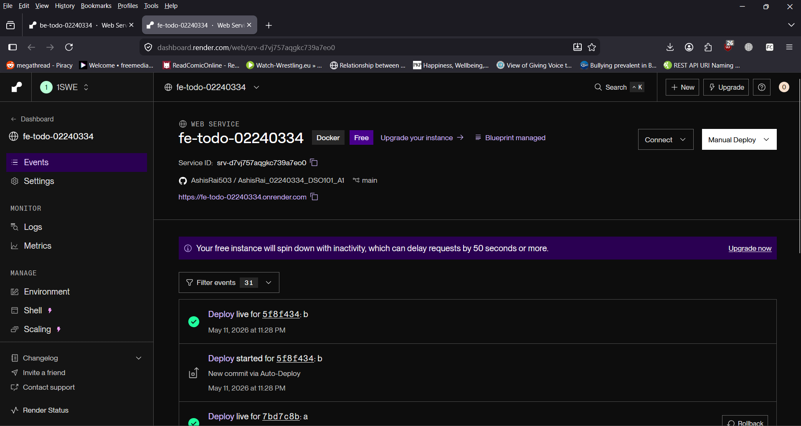

---

## 5. Testing Blueprint Backend

The Blueprint backend was tested using:

```text
https://be-todo-02240334.onrender.com
```

and:

```text
https://be-todo-02240334.onrender.com/tasks
```

The `/tasks` endpoint returned task data successfully.

### Screenshot: Blueprint backend `/tasks`

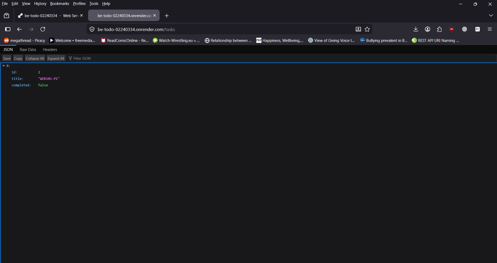

---

## 6. Testing Blueprint Frontend

The Blueprint frontend was tested using:

```text
https://fe-todo-02240334.onrender.com
```

The following features were tested:

- Add task
- Edit task
- Delete task
- Mark task as completed
- Refresh page and confirm task persistence

### Screenshot: Blueprint frontend working

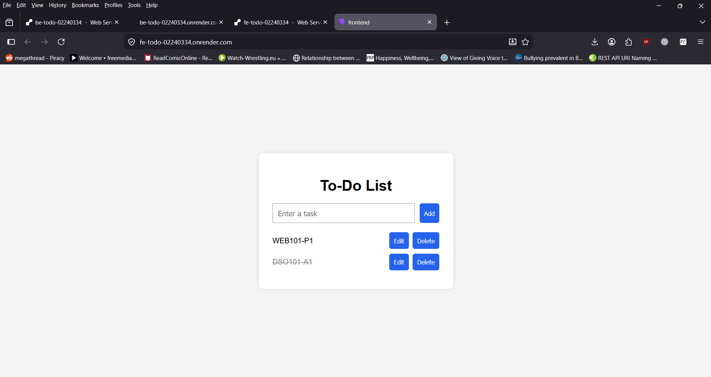

---

# Proof of Automatic Deployment

To prove that automatic deployment works, a small frontend text change was made.

The heading was changed from:

```jsx
<h1>To-Do List</h1>
```

to:

```jsx
<h1>To-Do List - Auto Deploy Test</h1>
```

Then the change was committed and pushed to GitHub.

```bash
git add todo-app/frontend/src/App.jsx
git commit -m "Test automatic deployment"
git push origin main
```

After pushing the commit, Render automatically started a new deployment for the Blueprint frontend service.

This proves the CI/CD flow:

```text
GitHub Commit → Render Auto Build → Render Auto Deploy → Live Website Updated
```

### Screenshot: GitHub commit for auto deploy test


### Screenshot: Render automatic deploy triggered


### Screenshot: Updated live frontend after auto deploy


---

# Docker Images

## Backend Image

```text
ash5zero3/be-todo:02240334
```

## Frontend Image

```text
ash5zero3/fe-todo:02240334
```

---

# Deployment Links

## Part A - Manual Deployment

Backend:

```text
Paste your Part A backend Render URL here
```

Frontend:

```text
Paste your Part A frontend Render URL here
```

## Part B - Blueprint Deployment

Backend:

```text
https://be-todo-02240334.onrender.com
```

Frontend:

```text
https://fe-todo-02240334.onrender.com
```

---

# Problems Faced and Solutions

## 1. Frontend Docker Build Failed Because of Node Version

The first frontend Docker build failed because Vite required a newer Node.js version.

### Solution

The frontend Dockerfile was changed from:

```dockerfile
FROM node:18-alpine AS build
```

to:

```dockerfile
FROM node:22-alpine AS build
```

---

## 2. Docker Container Could Not Connect to Local PostgreSQL

When testing the backend Docker container locally, `localhost` did not work for connecting to PostgreSQL.

### Solution

`host.docker.internal` was used as the database host.

```env
DB_HOST=host.docker.internal
```

---

## 3. Blueprint Database Region Issue

At first, the Blueprint services were created in a different region from the Render PostgreSQL database.

This caused the backend to fail when connecting to the database.

### Solution

The Blueprint services were recreated in the Singapore region, the same region as the Render PostgreSQL database.

---

## 4. Protecting Secret Values

The project uses `.env` files and Render environment variables for secret values.

The following files were not committed to GitHub:

```text
.env
todo-app/backend/.env
todo-app/frontend/.env
```

---

# Conclusion

This assignment helped me understand the complete CI/CD workflow for a full-stack web application. I created a simple To-Do List application using React, Node.js, Express, and PostgreSQL. Then I containerized the frontend and backend using Docker, pushed both images to Docker Hub, and manually deployed them on Render.

For the automated deployment part, I used Render Blueprint with a `render.yaml` file. This allowed Render to build and deploy the services automatically from GitHub whenever a new commit was pushed.

Through this assignment, I learned how frontend, backend, database, Docker, Docker Hub, GitHub, and Render work together in a deployment pipeline.
