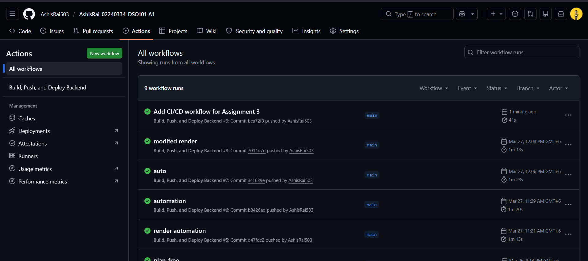
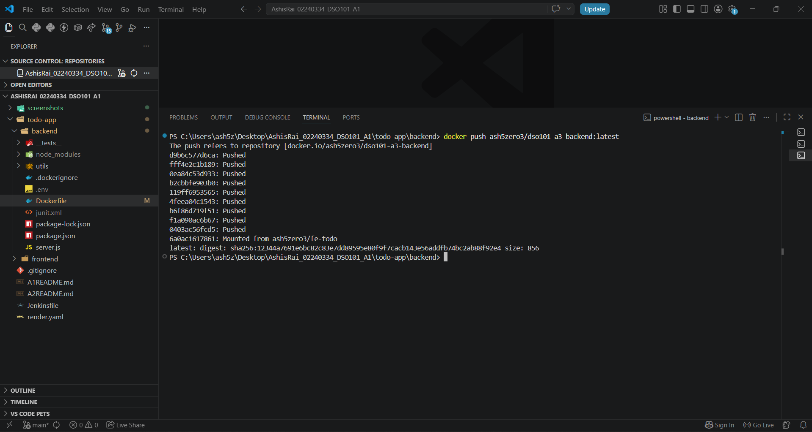
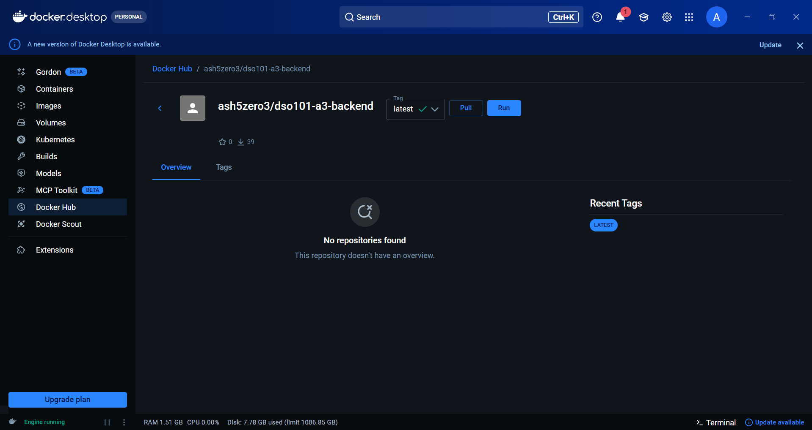
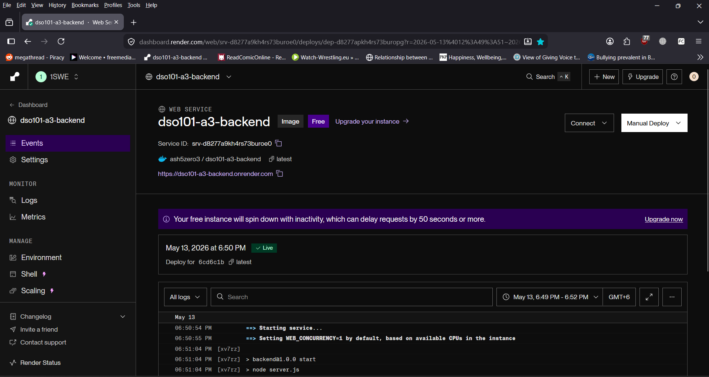
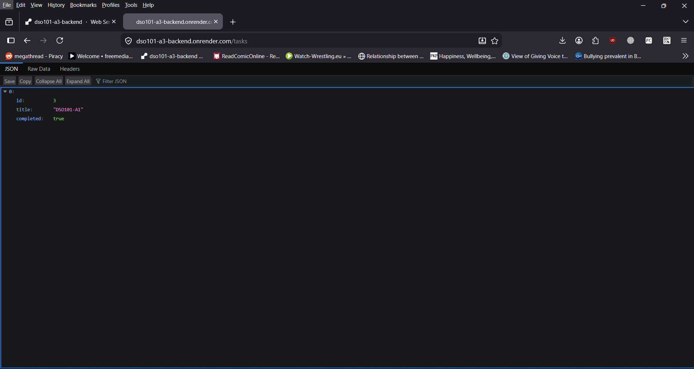

# Assignment 3: Continuous Integration and Continuous Deployment

## Student Information

**Name:** Ashis Rai  
**Student ID:** 02240334  
**Module:** DSO101  
**Assignment:** Assignment III - Continuous Integration and Continuous Deployment  

---

## Project Overview

This assignment focuses on setting up a CI/CD pipeline for the to-do list backend application from Assignment 1. The application was containerized using Docker, pushed to DockerHub, and deployed on Render using an existing Docker image.

GitHub Actions was configured to automate the process of building the Docker image, pushing the image to DockerHub, and triggering a Render deployment using a Render deploy hook.

---

## Tools and Technologies Used

- GitHub
- GitHub Actions
- Docker
- DockerHub
- Render.com
- Node.js
- npm
- Jest

---

## Repository Structure

```text
AshisRai_02240334_DSO101_A1/
│
├── .github/
│   └── workflows/
│       └── deploy.yml
│
├── screenshots/
│   ├── github-actions-success.png
│   ├── dockerhub-image.png
│   ├── render-deployment.png
│   └── render-api-output.png
│
└── todo-app/
    └── backend/
        ├── Dockerfile
        ├── package.json
        ├── package-lock.json
        ├── server.js
        └── __tests__/
```

---

## Steps Taken

### 1. Verified the Backend Application

The backend application was first tested locally using npm. The server started successfully on port `5000` and connected to the database.

The test script was also executed using the following command:

```bash
npm test
```

The test result showed that all test cases passed successfully.

---

### 2. Created and Verified the Dockerfile

A Dockerfile was added inside the backend folder. The Dockerfile uses Node.js Alpine as the base image, installs dependencies, copies the backend files, runs tests, exposes port `5000`, and starts the application.

```dockerfile
# Use Node.js LTS
FROM node:20-alpine

# Set working directory
WORKDIR /app

# Copy package files
COPY package*.json ./

# Install dependencies
RUN npm install

# Copy all files
COPY . .

# Run tests
RUN npm test

# Expose the app port
EXPOSE 5000

# Start the app
CMD ["npm", "start"]
```

---

### 3. Built the Docker Image Locally

The Docker image was built locally using the following command:

```bash
docker build -t todo-app-backend .
```

The Docker image was created successfully.

---

### 4. Tested the Docker Container Locally

The Docker container was tested locally using the environment variables from the `.env` file.

Since the database was running on the host machine, `DB_HOST` was temporarily changed to `host.docker.internal` during the Docker run command. This was required because `localhost` inside a Docker container refers to the container itself, not the host machine.

```bash
docker run --name todo-backend-test --env-file .env -e DB_HOST=host.docker.internal -p 5000:5000 todo-app-backend
```

The container ran successfully and showed that the server was running on port `5000`.

---

### 5. Pushed Docker Image to DockerHub

A public DockerHub repository was created:

```text
ash5zero3/dso101-a3-backend
```

The local Docker image was tagged and pushed to DockerHub using the following commands:

```bash
docker tag todo-app-backend:latest ash5zero3/dso101-a3-backend:latest
docker push ash5zero3/dso101-a3-backend:latest
```

The image was successfully pushed to DockerHub.

---

### 6. Created Render Web Service

A new Render web service was created using the existing DockerHub image:

```text
docker.io/ash5zero3/dso101-a3-backend:latest
```

The required environment variables were added in Render:

```text
PORT
DB_HOST
DB_USER
DB_PASSWORD
DB_NAME
DB_PORT
```

The Render service was deployed successfully and the backend API was accessible online.

---

### 7. Created GitHub Actions Workflow

A GitHub Actions workflow file was created at:

```text
.github/workflows/deploy.yml
```

The workflow performs the following tasks:

1. Checks out the repository.
2. Logs in to DockerHub.
3. Builds the Docker image.
4. Pushes the image to DockerHub.
5. Triggers Render deployment using the Render deploy hook.

---

## GitHub Actions Workflow

```yaml
name: Build, Push, and Deploy Backend

on:
  push:
    branches: ["main"]

jobs:
  build-and-deploy:
    runs-on: ubuntu-latest

    steps:
      - name: Checkout Repository
        uses: actions/checkout@v4

      - name: Login to DockerHub
        uses: docker/login-action@v3
        with:
          username: ${{ secrets.DOCKERHUB_USERNAME }}
          password: ${{ secrets.DOCKERHUB_TOKEN }}

      - name: Build Docker Image
        run: |
          docker build -t ${{ secrets.DOCKERHUB_USERNAME }}/dso101-a3-backend:latest ./todo-app/backend

      - name: Push Docker Image
        run: |
          docker push ${{ secrets.DOCKERHUB_USERNAME }}/dso101-a3-backend:latest

      - name: Trigger Render Deployment
        run: |
          curl -X POST ${{ secrets.RENDER_DEPLOY_HOOK_URL }}
```

---

## GitHub Secrets Used

The following GitHub repository secrets were added:

```text
DOCKERHUB_USERNAME
DOCKERHUB_TOKEN
RENDER_DEPLOY_HOOK_URL
```

Credentials were not hardcoded in the source code. Instead, GitHub Secrets and Render environment variables were used to store sensitive information securely.

---

## Screenshots

### Successful GitHub Actions Workflow



### DockerHub Image Push




### Render Deployment



### Render API Output



---

## Deployment Link

Render deployment link:

```text
https://dso101-a3-backend.onrender.com
```

API endpoint tested:

```text
https://dso101-a3-backend.onrender.com/tasks
```

---

## Challenges Faced

One challenge faced during the assignment was running the Docker container locally with the database connection. The application worked normally using `localhost`, but inside Docker, `localhost` referred to the container itself instead of the host machine. This caused a database connection issue. The issue was solved by temporarily using `host.docker.internal` for the `DB_HOST` value while running the Docker container locally.

Another challenge was pushing the Docker image to DockerHub. At first, the push failed because of a DockerHub username mismatch. This was solved by correcting the DockerHub username and pushing the image again.

A further challenge was understanding how Render redeployment works with DockerHub images. Pushing a new image to DockerHub does not automatically redeploy the Render service. This was solved by using a Render deploy hook in the GitHub Actions workflow.

---

## Learning Outcomes

Through this assignment, I learned how to create a Docker image for a Node.js backend application and test it locally. I also learned how to push Docker images to DockerHub and deploy an existing Docker image on Render.

I understood how GitHub Actions can be used to automate CI/CD tasks such as building Docker images, pushing them to DockerHub, and triggering Render deployment using a deploy hook.

I also learned the importance of storing credentials securely using GitHub Secrets and Render environment variables instead of hardcoding them in the source code.

---

## Conclusion

The CI/CD pipeline was successfully implemented for the to-do backend application. The backend was containerized using Docker, pushed to DockerHub, and deployed on Render. GitHub Actions was configured to automate the build, push, and deployment process whenever changes are pushed to the `main` branch.

The deployed backend was tested successfully using the `/tasks` API endpoint.
